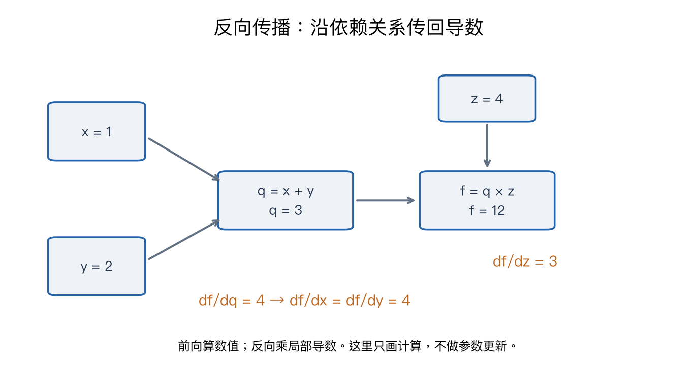

# 第四章：神经网络与反向传播

> CS231n 2025 Lecture 4，2025-04-10，Ehsan Adeli。依据对应官方课件整理；解释、图和手算例为原创学习补充，不是视频逐字稿。前置：[第三章](03-regularization-optimization.md)。

## 1. 为什么线性分类器还不够？

线性分类器 s=Wx+b 在输入空间中只能产生线性决策边界。例如，二维平面中一类点围绕原点，另一类点形成外圈，用一条直线无法把内外两类完全分开。

可以先把原坐标映射成新特征，再分类。比如使用半径平方 x₁²+x₂²，就能用一个阈值区分内圈和外圈。神经网络的重要思想是：**特征变换也可以从数据中学习，而不必全部手工设计。**

第一遍按“前向计算 → 局部导数 → 链式法则 → 矩阵反传”阅读。Jacobian 的完整形式可第二遍再看。

## 2. 两层网络：每一步的形状

本章先用单样本列向量约定。输入 x∈Rᴰ，隐藏层宽度 H，类别数 C：

$$a=W_1x+b_1,\qquad h=\operatorname{ReLU}(a),\qquad s=W_2h+b_2.$$

| 变量 | 形状 | 作用 |
|---|---|---|
| W₁ | H×D | 把输入投影到 H 个隐藏特征 |
| b₁、a、h | H×1 | 隐藏层偏置、激活前值、激活后值 |
| W₂ | C×H | 用隐藏特征给各类别打分 |
| b₂、s | C×1 | 输出偏置与类别分数 |

“两层”通常数有可学习权重的层，不把输入本身算一层；因此它也叫“单隐藏层网络”。不同资料计数约定可能不同。

隐藏单元不是预先指定为“识别耳朵”或“识别轮子”。这些语义有时可以通过可视化观察到，但训练直接优化的是损失。

### 为什么必须有非线性？

若删除 ReLU：

$$s=W_2(W_1x+b_1)+b_2=(W_2W_1)x+(W_2b_1+b_2).$$

这仍然只是一个仿射变换，叠很多层也不会因此获得非线性决策边界。非线性激活使层的组合无法简单合并。

## 3. 激活函数与导数

| 函数 | 定义 | 反向传播要点 |
|---|---|---|
| ReLU | max(0,a) | a>0 时导数为 1，a<0 时为 0 |
| Sigmoid | 1/(1+e⁻ᵃ) | 导数 σ(a)(1−σ(a))，饱和区导数小 |
| tanh | 双曲正切 | 导数 1−tanh²(a)，也有饱和区 |

ReLU 在 0 不可导，实现通常选择一个约定值，例如 0。它在正区间不饱和，但负区间梯度为零，不能保证所有神经元一直有效。

输出层通常保留原始分数，再交给相应损失；并不是每个输出都要额外经过 ReLU。

## 4. 计算图与链式法则

把复杂函数拆成小运算：加法、乘法、矩阵乘法、非线性等。前向时按依赖顺序计算数值，反向时逆着依赖关系传递梯度。



图中前向例子为 f=(x+y)z，取 x=1、y=2、z=4：先得到 q=3，再得到 f=12。反向传播从 ∂f/∂f=1 开始。

$$\frac{\partial f}{\partial q}=z=4,\qquad
\frac{\partial f}{\partial z}=q=3.$$

因为 q=x+y：

$$\frac{\partial f}{\partial x}
=\frac{\partial f}{\partial q}\frac{\partial q}{\partial x}=4\times1=4,$$
$$\frac{\partial f}{\partial y}=4.$$

对一个节点，应区分：

- **上游梯度**：最终损失对节点输出的导数。
- **局部导数**：节点输出对节点输入的导数。
- **下游梯度**：两者通过链式法则组合得到的结果。

反向传播计算的是损失对所有参数的导数；它本身没有更新参数。更新由 SGD、Adam 等优化器完成。

### 分支为什么要相加？

如果 x 被两条路径使用，两条路径都能影响最终损失，必须把贡献相加。例如 f=x²+x，导数是 2x+1，不能只保留最后一条路径。

同一参数在不同位置被重复使用时也一样。这会在卷积的权重共享和 RNN 的时间共享中反复出现。

## 5. 一个完整的“小网络”手算

考虑标量网络：

$$a=wx+b,\quad h=\max(0,a),\quad \hat y=vh+c,
\quad L=\frac12(\hat y-y)^2.$$

取 x=2，y=1，w=1，b=−1，v=2，c=0。平方损失用于让计算简单，这是教学回归例子，不是本课分类任务必须使用的损失。

**前向：** a=1，h=1，ŷ=2，L=0.5。

**反向从最后一层开始：**

$$\frac{\partial L}{\partial\hat y}=\hat y-y=1.$$

然后乘上输出层的局部导数：

$$\frac{\partial L}{\partial v}=1\times h=1,\quad
\frac{\partial L}{\partial c}=1,\quad
\frac{\partial L}{\partial h}=1\times v=2.$$

a>0，ReLU 导数为 1，所以 ∂L/∂a=2。继续向输入层传播：

$$\frac{\partial L}{\partial w}=2x=4,\quad
\frac{\partial L}{\partial b}=2,\quad
\frac{\partial L}{\partial x}=2w=2.$$

以学习率 0.1，同时更新所有参数：w=0.6，b=−1.2，v=1.9，c=−0.1。新的 a=0、h=0、ŷ=−0.1，损失变成 0.605。

这个刻意保留的结果提醒我们：**梯度正确也不保证任意有限步长都降低损失。** 此处 0.1 跨过了激活边界。若取 0.01，更新后 w=0.96、b=−1.02、v=1.99、c=−0.01，得到 a=0.9、ŷ=1.781、L=0.3049805，损失下降。

这里所有梯度均用同一组旧参数计算，不能先改 v 再拿新的 v 去算 w 的梯度。

## 6. Softmax 与交叉熵为什么得到 p−y？

对单个样本，正确类别为 k：

$$L=-s_k+\log\sum_j e^{s_j}.$$

分别对 s_c 求导：第一项贡献 −1[c=k]；第二项贡献 e^{s_c}/Σ_j e^{s_j}=p_c。于是：

$$\boxed{\frac{\partial L}{\partial s_c}=p_c-\mathbf1[c=k].}$$

若正确类别是第一类、预测概率 p=[0.7,0.2,0.1]，则对分数的梯度为 [−0.3,0.2,0.1]。负梯度方向会提高正确类别分数，并降低其他类别分数。

这里的 y 如果写成向量，必须是 one-hot 标签，不能直接拿整数类别编号去做 p−y。

## 7. 矩阵反传：最值得熟悉的一组公式

为了与 NumPy 的批量计算衔接，以下改为**每一行一个样本**：X∈Rᴺˣᴰ，W∈Rᴰˣᴹ，b∈Rᴹ。

$$Y=XW+b.$$

设上游梯度 G=∂L/∂Y，形状 N×M：

$$\boxed{\frac{\partial L}{\partial X}=GW^T},\qquad
\boxed{\frac{\partial L}{\partial W}=X^TG},\qquad
\boxed{\frac{\partial L}{\partial b}=\sum_{i=1}^N G_{i,:}}.$$

为什么偏置要求和？因为同一个 b 被广播到每一行，影响了每个样本，反向时需要汇总所有贡献。

为什么 W 的梯度是 XᵀG？逐元素展开 Y_im=Σ_d X_id W_dm+b_m，得：

$$\frac{\partial L}{\partial W_{dm}}=\sum_i X_{id}G_{im},$$

恰好是矩阵乘法 XᵀG 的第 d,m 个元素。维度也吻合：(D×N)(N×M)=D×M。

一个 NumPy 两层分类器的反传核心为：

```python
# X: (N, D), W1: (D, H), W2: (H, C)
a = X @ W1 + b1
h = np.maximum(a, 0)
scores = h @ W2 + b2
shifted = scores - scores.max(axis=1, keepdims=True)
p = np.exp(shifted)
p /= p.sum(axis=1, keepdims=True)

ds = p.copy()
ds[np.arange(len(X)), labels] -= 1
ds /= len(X)  # 对平均数据损失求导，只除一次 N

dW2 = h.T @ ds
db2 = ds.sum(axis=0)
dh = ds @ W2.T
da = dh * (a > 0)
dW1 = X.T @ da
db1 = da.sum(axis=0)
```

这是解释形状的代码片段，未包含初始化、正则化与训练循环。若总目标加 λ‖W‖²/2，则分别在 dW1、dW2 加 λW1、λW2。完整可运行的数值核验见[配套实验](../experiments/remaining_examples.py)。

## 8. Jacobian 不一定要显式构造

若 y=f(x)，x 有 D 维、y 有 M 维，Jacobian 的形状为 M×D，每个元素是 ∂y_m/∂x_d。

反向传播实际需要的是 J_fᵀg_y，而不是先保存整个 Jacobian。像 ReLU 这样的逐元素运算，Jacobian 为对角结构，直接逐元素乘掩码即可。这是大网络能够高效求梯度的重要原因。

## 9. 复习与易错点

| 常见困惑 | 应记住的区别 |
|---|---|
| 反向传播是不是梯度下降？ | 前者算梯度，后者使用梯度更新 |
| 深度为什么有用？ | 需要非线性；单纯叠仿射层仍是仿射函数 |
| 梯度为什么形状相同？ | 每个参数元素都对应一个偏导数 |
| 参数共享怎样反传？ | 汇总所有使用位置的梯度 |
| 梯度为零是否学完了？ | 也可能是失活或饱和，不一定是好解 |
| 梯度检查不一致怎么办？ | 检查平均因子、转置、分支累加，并避开不可导点 |

**主线：前向保存中间量，反向沿计算图组合局部导数，优化器最后统一更新参数。**

## 来源与阅读定位

- [官方第四讲课件](https://cs231n.stanford.edu/slides/2025/lecture_4.pdf)：PDF 第 21–50 页为网络，56–109 页为标量反传，115–145 页为向量与矩阵反传。
- [官方配套笔记：Backpropagation](https://cs231n.github.io/optimization-2/)：辅助阅读；上述手算数字与图为本笔记原创。
- [对应 B 站 P4](https://www.bilibili.com/video/BV1aXhJ64EmW/?p=4)。本章核对依据为课件，未声称逐句核对视频音频。

下一章：[卷积神经网络](05-convolutional-networks.md)。
